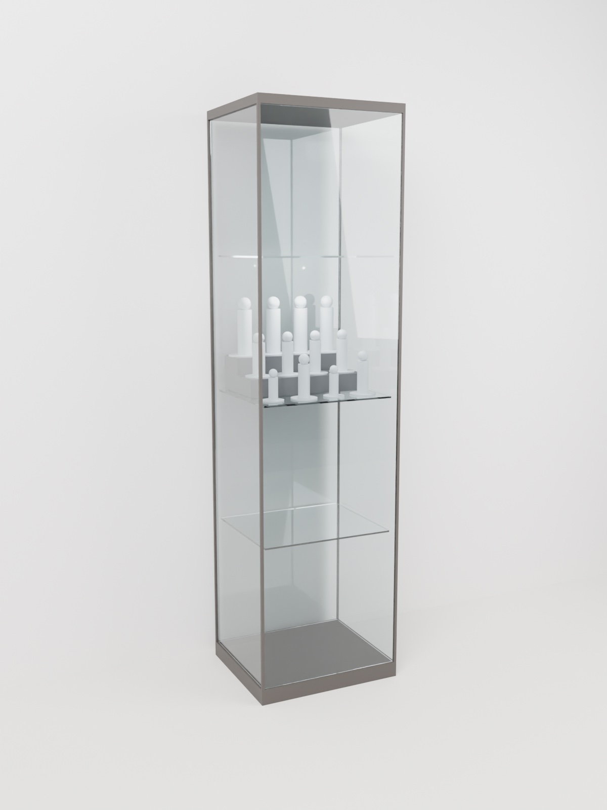
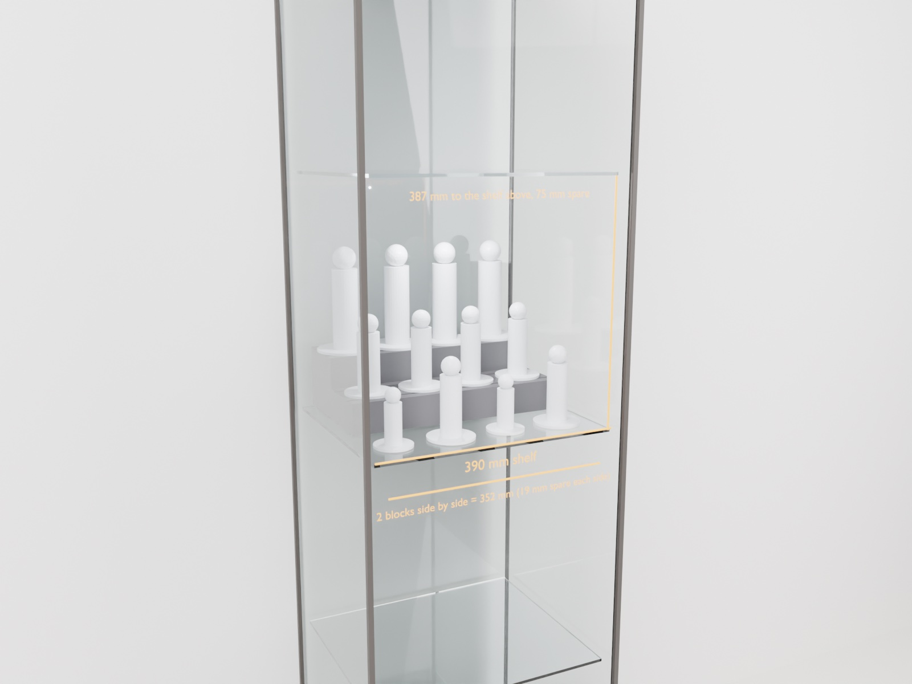
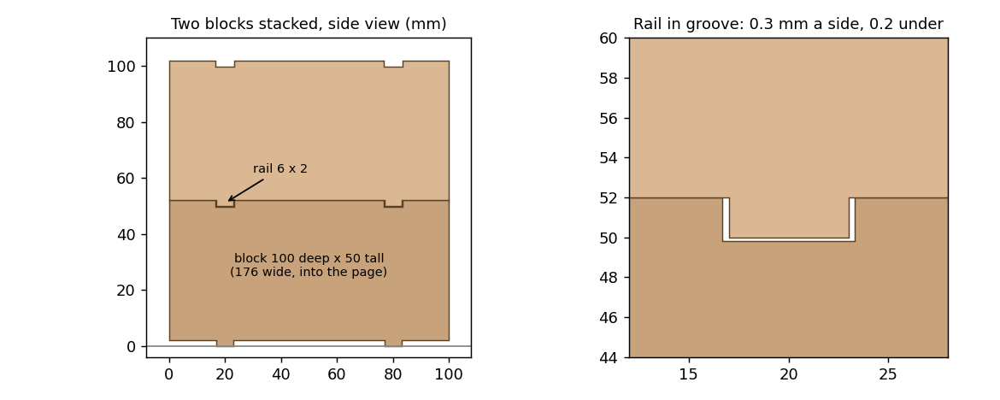
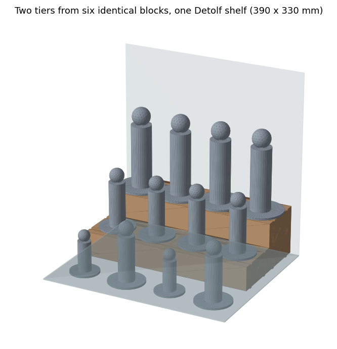

# Case study: a figure display riser, from a sentence to a running print

One conversation with Claude, connected to an A1 mini through this server, on
3 October 2026. Every step below (the design, the trade-offs, the slicing, the
safety checks, starting the print and watching it) happened in that
conversation. The person's part was to say what they wanted, answer "print it",
and take the finished part off the plate.

Numbers are labelled **MEASURED** (from the printer or the run journal) or
**ESTIMATED** (from the slicer or the design model).

<p align="center">
  
  
</p>

*Rendered in Blender from the same meshes that were sliced: six blocks on the
third level of a 43 × 37 × 163 cm Detolf, glass door removed for the close-up.
Grey figures are stand-ins for scale.*

## 1. The ask

> *"I want to print a figurine display rack, much like a staircase. What design
> options are there?"*

Claude proposed two concepts and built both as meshes with stand-in figures
(small 60 mm base × 100 mm tall, medium 75 × 150, large 95 × 210). It showed
them in a 3D viewer in the app's browser pane, because a description of a
staircase is no substitute for rotating one.

> *"Design it so it maximizes space in an IKEA Detolf, on one of the shelves."*

Claude looked up the shelf. Detolf owners measure about 390 × 330 mm of usable
glass, with 381–394 mm between shelves. These are community figures, so the
write-up says so. The A1 mini prints at most 180 mm a side, so one print cannot
fill a shelf. Two 176 mm risers side by side cover 352 of the 390 mm, with the
glass in front as a further row.

## 2. Trade-offs, measured instead of guessed

> *"Any way we can speed up the print?"*

Claude sliced the riser four ways with Bambu Studio and reported the slicer's
own figures (**ESTIMATED**):

| Settings | Time | Filament |
|---|---|---|
| 0.24 mm layers, 3 walls, 5% infill | 7 h 18 min | 338 g |
| 0.28 mm, 3 walls, 5% | 7 h 02 min | 330 g |
| **0.28 mm, 2 walls, 5%** | **6 h 08 min** | **284 g** |
| 0.28 mm, 2 walls, 5%, wider lines | 6 h 47 min | 319 g |

The finding: print time follows the volume of plastic, so settings alone buy
about 15%.

> *"Can we make it stackable, to use the vertical height?"*

That changed the design. The new design is one identical block, 176 × 100 × 50
mm. Two rails underneath drop into two grooves on top of the block below.
Columns of 1, 2 or 3 blocks make the tiers.



Claude checked the fit on the meshes before printing (**ESTIMATED**, from the
model). Two stacked blocks overlap by 0 mm³. Sliding the upper block 0.31 mm
forward makes them collide, so a stack cannot creep forward or back. Each block
prints upside down, with the display face on the textured plate and the rails
pointing up, so it needs no supports. One block: **2 h 56 min, 122 g**
(ESTIMATED). Two tiers for a full shelf take 6 blocks.

Generator: [examples/detolf_riser/stack_riser.py](../examples/detolf_riser/stack_riser.py); cabinet renders: [render_detolf.py](../examples/detolf_riser/render_detolf.py) (`blender -b -P render_detolf.py -- OUTDIR`).



## 3. Printing, and watching it

Claude asked before every print; "print it" is the person's word, never the
model's. Then:

```
upload_and_print(local_path=..., confirm=True)   -> run 10, preflight passed silently
watch_print(run_id=10)                           -> a frame at each stage
review_print_stages / read_capture               -> Claude looks at each frame
caption_print_stage(...)                         -> and writes down what it saw
print_report(run_id=10)                          -> the run, start to finish
log_print_result(run_id=10, outcome="success")
```

The run journal for block 1 (**MEASURED**; Claude's captions, abridged):

| Time | Layer | Caption |
|---|---|---|
| 16:33 | 0 | Plate clear and empty, toolhead parked. |
| 16:48 | 2 | Bed at the front edge and moving; first layer **cannot be judged from this frame**. No alerts. |
| 17:32 | 47 | Walls standing, sparse grid infill visible. No spaghetti, no detached part. |
| 17:58 | 93 | Layers even and upright. No lift or shift. |
| 18:24 | 140 | Full-width block, edges straight, no corner lift. |
| 19:27 | 186 | Complete. Both rails full width, straight edges, no stringing. |

Printing took **2 h 54 min** (MEASURED, start frame to finished frame) against
the slicer's 2 h 56 min.

## 4. The safety check that earned its keep

Asked *"do we have a report with the checks to ensure the print is safe?"*,
Claude found the honest answer was **no**. `upload_and_print` runs a preflight,
but a clean pass says nothing, so nothing was on record. For block 2 it wrote
every check down, pass or fail, and the record caught a real problem on its
first run:

| Check | Block 2, first attempt |
|---|---|
| Sliced file: firmware model id, textured plate, bed temperature, layer height, A1 mini start macro | PASS |
| Server preflight (bed temperature for the filament, plate type) | PASS |
| Every extrusion inside the 180 × 180 mm plate | PASS |
| **First layer clear of the purge line** | **FAIL**: first layer at Y 2.2–177.8 mm, purge line at X 60–120, Y 0–6 |
| Printer idle, no alerts | PASS |
| Loaded filament matches the file | PASS |
| Plate clear (judged from a camera frame) | PASS |

The slicer's auto-arrange had turned the part 90 degrees. Placed that way, its
first layer lands on the line the printer purges at the front of the plate.
The check that would have caught it read the *model's* footprint, not the
*toolpath's*, so it reported a position the toolhead never went to. Block 1 had
gone out the same way. Claude switched off auto-arrange, placed the part itself,
re-sliced, and re-checked. All eight checks passed, toolpath at X 2.2–177.8,
Y 40.2–139.8 mm, and block 2 started (run 11).

## What this run showed, good and bad

- **The loop closes in one place.** Design, trade-off numbers, slicing, a
  recorded preflight, the print, a captioned stage-by-stage report, and the
  logged outcome all happened in one conversation, with real hardware at the
  end of it.
- **Checks that leave a record find more than checks that only block.** The
  purge-line overlap was not a blocker anywhere until someone asked to see the
  passes.
- **The camera has a blind spot.** At the first-layer milestone the A1 mini's
  bed is often at the front and moving, and the plate is out of view. The most
  important frame of the run was the least informative. Capturing it when the
  bed is at the back would fix it.
- **The report has gaps.** `print_report` returned no predicted time and no
  duration for run 10. The 2 h 54 min above was computed from the journal's
  frame timestamps. The printer also reported the loaded filament as white;
  the frames show dark grey.
